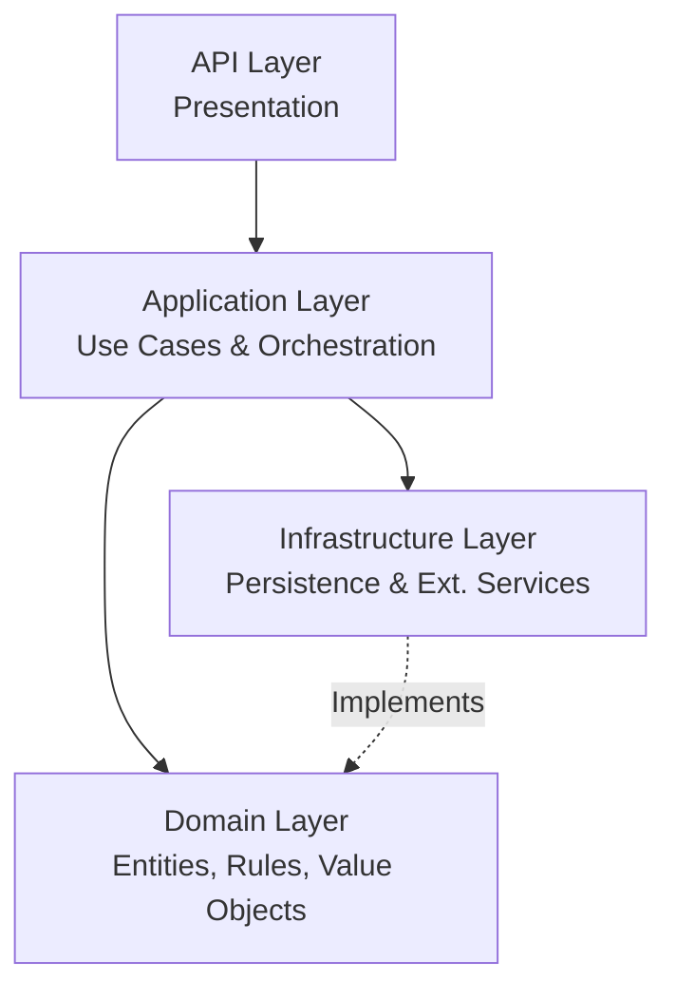

# Hotel Reservation API - Domain-Driven Design Implementation


Implementasi lengkap Hotel Reservation System menggunakan Domain-Driven Design (DDD) dengan FastAPI dan Pydantic.

## 📋 Table of Contents
- [Project Overview](#-project-overview)
- [Tech Stack](#-tech-stack)
- [Architecture & Design](#-architecture--design)
- [Project Structure](#-project-structure)
- [Installation & Setup](#-installation--setup)
- [Running the Server (Local)](#-running-the-server)
- [CI/CD Pipeline](#-cicd-pipeline)
- [Docker Deployment](#-docker-deployment)
- [Railway Deployment (Hosting)](#-railway-deployment-hosting)
- [Testing with Postman](#-testing-with-postman)
- [API Endpoints Reference](#-api-endpoints-reference)

---

## 📌 Project Overview

Sistem reservasi hotel dengan 3 Aggregates utama:
- **Reservation Aggregate**: Manajemen pemesanan kamar dengan validasi bisnis lengkap (Check-in/out, Refund Policy, dll)
- **Availability Aggregate**: Tracking ketersediaan kamar, stok, dan overbooking threshold.
- **Waitlist Aggregate**: Daftar tunggu (waiting list) dengan sistem prioritas cerdas (Priority Score).

**Key Features:**
- ✅ **Domain-Driven Design (DDD)** 4-Layer Architecture.
- ✅ **Authentication**: JWT-based auth dengan bcrypt hashing.
- ✅ **Unit Testing**: 95% Code Coverage dengan Pytest & CI/CD.
- ✅ **Infrastructure**: In-Memory Repository (mudah di-switch ke SQL/NoSQL).
- ✅ **API Docs**: Swagger UI & ReDoc auto-generated.

---

## 🛠 Tech Stack

| Komponen | Version | Fungsi |
|----------|---------|--------|
| **Python** | 3.9+ | Main Language |
| **FastAPI** | 0.104+ | Web Framework |
| **Pydantic** | 2.5+ | Data Validation & Settings |
| **Uvicorn** | 0.24+ | ASGI Server |
| **Pytest** | 7.4+ | Testing Framework |
| **Docker** | Latest | Containerization |
| **GitHub Actions** | - | CI/CD Pipeline |

---

## 🏗️ Architecture & Design

Project ini menggunakan **4-Layer Architecture** sesuai prinsip DDD untuk pemisahan interest yang jelas:



1.  **Domain Layer** (`domain/`): Inti bisnis. Tidak depend ke layer apapun. Berisi Entities (`Reservation`, `Availability`), Value Objects (`Money`, `DateRange`), dan Interfaces.
2.  **Application Layer** (`application/`): Mengatur alur kerja aplikasi (Service Classes). Menggabungkan domain objects untuk menyelesaikan use case.
3.  **Infrastructure Layer** (`infrastructure/`): Implementasi detail teknis (Database, External API). Saat ini menggunakan In-Memory Repositories.
4.  **API Layer** (`api/`): Interface keluar (FastAPI Endpoints, Schemas/DTOs).

---

## 📁 Project Structure

```
TST TUBES MILESTONE 4/
├── .github/workflows/       # CI/CD Configurations
├── api/                     # Layer Presentasi (Endpoints)
├── application/             # Layer Aplikasi (Services)
├── domain/                  # Layer Domain (Entities, Rules)
├── infrastructure/          # Layer Infrastruktur (Repos)
├── main.py                  # Entry Point Aplikasi
├── Dockerfile               # Docker Config
├── docker-compose.yml       # Docker Compose Config
├── railway.json             # Railway Deployment Config
├── requirements.txt         # Dependencies
├── README.md                # Dokumentasi Utama
└── POSTMAN_COLLECTION.json  # File Testing API
```

---

## 🚀 Installation & Setup

1.  **Clone Repository**
    ```bash
    git clone https://github.com/KenzieRafa/Reservation-API.git
    cd Reservation-API
    ```

2.  **Create Virtual Environment (Optional but Recommended)**
    ```bash
    python -m venv venv
    # Windows
    venv\Scripts\activate 
    # Mac/Linux
    source venv/bin/activate
    ```

3.  **Install Dependencies**
    ```bash
    pip install -r requirements.txt
    ```

---

## ▶️ Running the Server

### Method 1: Direct Run (Local)
```bash
python main.py
```
Server akan berjalan di `http://0.0.0.0:8000`.
- **Swagger Docs**: [http://localhost:8000/docs](http://localhost:8000/docs)
- **Health Check**: [http://localhost:8000/api/health](http://localhost:8000/api/health)

### Method 2: Development Mode (Auto-reload)
```bash
uvicorn main:app --reload
```

---

## 🔄 CI/CD Pipeline

Project ini sudah dilengkapi dengan **GitHub Actions** (`.github/workflows/ci.yml`) yang otomatis berjalan saat ada `push` atau `pull_request` ke branch `main`.

**Apa yang dilakukan CI/CD?**
1.  **Linting**: Memeriksa kerapihan kode (`flake8`, `black`, `isort`).
2.  **Testing**: Menjalankan Unit Tests dengan `pytest`.
3.  **Coverage**: Memastikan test coverage di atas **95%**.
4.  **Health Check**: Memastikan server bisa menyala tanpa error.

Jika tanda checklist (badge) di atas repo berwarna **Hijau**, berarti kode aman dan siap di-deploy.

---

## 🐳 Docker Deployment

Kamu bisa menjalankan aplikasi ini dalam container Docker tanpa perlu setup Python manual.

### 1. Build & Run (Manual)
```bash
# Build Image
docker build -t reservation-api .

# Run Container (Port 8000 dimapping ke 8000)
docker run -p 8000:8000 --name my-hotel-api reservation-api
```

### 2. Menggunakan Docker Compose (Recommended)
```bash
# Start Service
docker-compose up -d

# Stop Service
docker-compose down
```

Akses API tetap sama di `http://localhost:8000`.

---

## 🚂 Railway Deployment (Hosting)

Aplikasi ini sudah dikonfigurasi (`railway.json`, `Procfile`) untuk deployment otomatis ke **Railway**.

### Cara Deploy:
1.  **Push kode ke GitHub** repository kamu.
2.  Buka [Railway Dashboard](https://railway.app/).
3.  Klik **+ New Project** > **Deploy from GitHub repo**.
4.  Pilih repository ini.
5.  Klik **Deploy Now**.
6.  Railway akan otomatis membaca config dan melakukan build.
7.  Setelah sukses, kamu akan mendapatkan domain (contoh: `https://reservation-api-production.up.railway.app`).

**Environment Variables (Optional di Railway):**
- `SECRET_KEY`: Kunci rahasia untuk JWT (auto-generated jika tidak diisi).
- `ENVIRONMENT`: `production`.

---

## 📮 Testing with Postman

Kami menyediakan file koleksi Postman lengkap (`POSTMAN_COLLECTION.json`) untuk mempermudah testing semua endpoint.

### Cara Menggunakan:
1.  **Import Collection**:
    - Buka Postman.
    - Klik **Import** (pojok kiri atas).
    - Drag & Drop file `POSTMAN_COLLECTION.json`.

2.  **Login (PENTING)**:
    - Karena endpoint dilindungi JWT, kamu harus login dulu.
    - Buka folder **AUTH** > **Login**.
    - Send Request (Body default: `username: admin`, `password: admin123`).
    - **Copy Access Token** dari response.

3.  **Set Token**:
    - Di Postman, klik tab **Collections** > Klik Nama Collection Project ini.
    - Masuk tab **Authorization**.
    - Paste token di kolom **Token**.
    - (Atau paste manual di setiap request tab Auth > Bearer Token).

4.  **Jalankan Request Lain**:
    - Sekarang kamu bisa coba Create Reservation, Check Availability, dll.

---

## 📚 API Endpoints Reference

Berikut ringkasan endpoint utama. Dokumentasi detail bisa dilihat di `/docs` saat server berjalan.

### 🔐 Auth
- `POST /token`: Login & Get Token.
- `GET /users/me`: Get Profile.

### 🏨 Reservations
- `POST /api/reservations`: Buat reservasi baru.
- `PUT /api/reservations/{id}`: Ubah tanggal/kamar reservasi.
- `POST /api/reservations/{id}/confirm`: Konfirmasi pembayaran.
- `POST /api/reservations/{id}/check-in`: Check-in tamu.
- `POST /api/reservations/{id}/cancel`: Batalkan reservasi (dapat refund amount).

### 📅 Availability
- `POST /api/availability`: Setup ketersediaan kamar.
- `GET /api/availability/{type}/{date}`: Cek stok kamar tanggal tertentu.
- `POST /api/availability/block`: Blokir kamar (maintenance).

### 📝 Waitlist
- `POST /api/waitlist`: Masuk daftar tunggu (jika penuh).
- `POST /api/waitlist/{id}/convert`: Ubah waitlist jadi reservasi (jika sudah available).
- `POST /api/waitlist/{id}/upgrade-priority`: Naikkan prioritas (Bayar/VIP).
